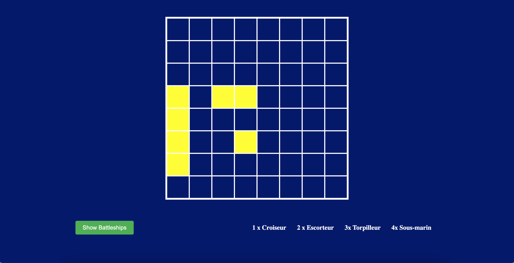

# Ripple-Battleship



## A Battleship game 
Built for Ripple Motion. 

A server side rendered game with Python and Django. 


The rule was to randomly place ships of different sizes on a grid, without them touching or overlapping each other. 

The goal of the game is to find the hidden ships. 

## How to play
```git clone``` the project 


```cd Ripple-Battleship```


```python3 manage.py runserver```


Open your browser and go to http://127.0.0.1:8000/

Enjoy !
